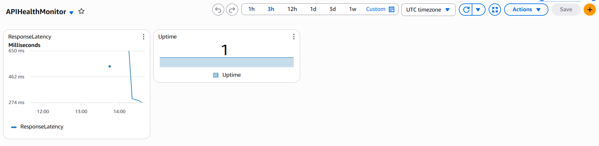

# Serverless API Health & Performance Monitor ☁️

An automated, serverless observability platform built on AWS to track the uptime and response latency of public APIs, complete with custom CloudWatch dashboards and automated SNS email alerts.

## 🏗️ Architecture

*(Note: Upload your architecture diagram to the images folder to make this link work)*

## 🚀 The Problem & Solution
**The Problem:** API downtime or severe latency spikes can silently break dependent applications, leading to poor user experiences if not caught immediately.
**The Solution:** I engineered a synthetic monitoring system using AWS serverless primitives that automatically checks target APIs on a cron schedule, visualizes health trends, and alerts administrators before users report the issue.

## 🛠️ Tech Stack & AWS Services
* **Compute:** AWS Lambda (Python 3.12)
* **Orchestration/Trigger:** Amazon EventBridge
* **Observability:** Amazon CloudWatch (Custom Metrics, Alarms, & Dashboards)
* **Notifications:** Amazon SNS (Simple Notification Service)
* **Target API:** Cat Facts API

## 📊 Live Dashboard & Alerting
By utilizing the `boto3` AWS SDK, the Lambda function generates and pushes custom `Uptime` and `ResponseLatency` metrics to CloudWatch. 

**CloudWatch Dashboard:**

*(Note: Add your screenshot here)*

**Automated Incident Alert:**
If the API response latency exceeds 500ms for two consecutive checks, a CloudWatch Alarm triggers an SNS topic to dispatch an incident email.

*(Note: Add your screenshot here)*

## 💡 Key Learnings
* **IAM Roles & Permissions:** Applied the principle of least privilege by securely attaching policies (`CloudWatchFullAccessV2`) to the Lambda execution role.
* **Custom Observability:** Transitioned from relying on default infrastructure metrics (CPU/Memory) to generating custom application-level telemetry.
* **Serverless Cost Optimization:** Designed the architecture to operate entirely within the AWS Always Free Tier.